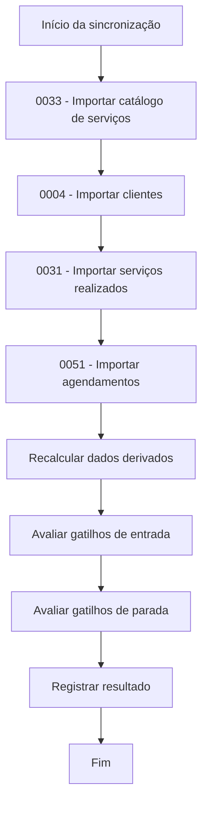
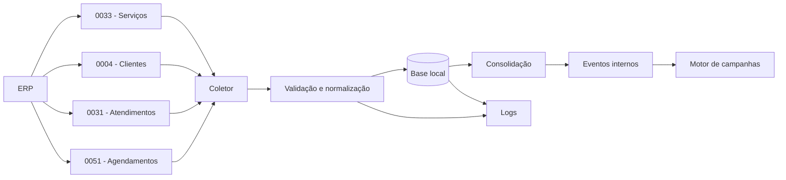
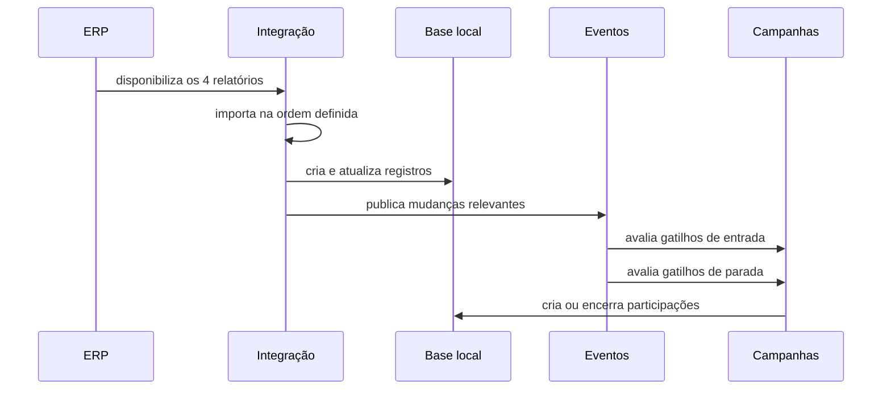
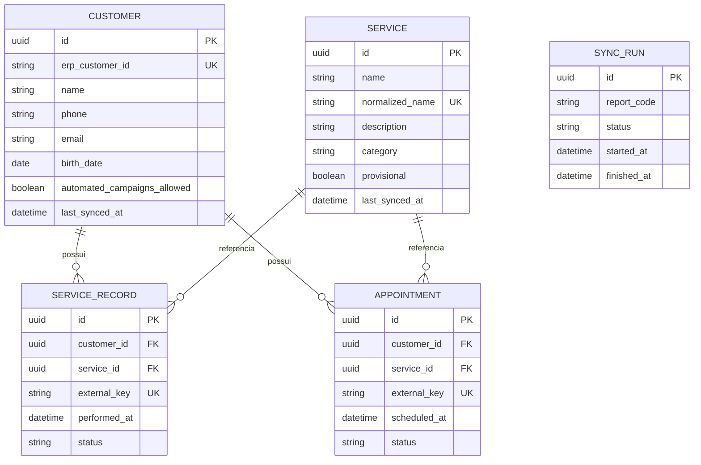

# Integração com o ERP

## 1. Objetivo

A integração com o ERP fornece ao Pombo Correio os dados necessários para:

- criar e atualizar clientes;
- criar e atualizar o catálogo de serviços;
- registrar serviços realizados;
- registrar agendamentos futuros;
- atualizar dados de contato a partir de informações mais recentes;
- calcular último atendimento e próximo agendamento;
- gerar eventos de entrada e parada de campanhas;
- manter a rastreabilidade das sincronizações.

O ERP permanece como fonte de verdade para clientes, serviços, atendimentos e agendamentos. O Pombo Correio mantém apenas uma cópia local dos dados necessários para consulta e automação.

## 2. Relatórios utilizados

A integração do MVP consumirá quatro relatórios:

| Ordem | Código | Relatório | Responsabilidade principal |
|---:|---|---|---|
| 1 | 0033 | Tabela de preços dos serviços | Criar e atualizar o catálogo de serviços |
| 2 | 0004 | Lista de dados de todos os clientes | Criar e atualizar clientes |
| 3 | 0031 | Serviços realizados no período | Registrar atendimentos e atualizar dados recentes |
| 4 | 0051 | Clientes com agendamentos | Registrar agendamentos futuros e regras de parada |

O valor presente no relatório 0033 não será utilizado pelo Pombo Correio.

## 3. Ordem oficial de importação

A ordem abaixo deve ser respeitada tanto na carga inicial quanto em cada ciclo completo de sincronização.

### 3.1. Relatório 0033 — Tabela de preços dos serviços

Deve ser importado primeiro para que os atendimentos posteriores possam ser associados ao catálogo.

Responsabilidades:

- criar serviços inexistentes;
- atualizar nome, descrição e categoria;
- completar serviços provisórios;
- disponibilizar categorias para gatilhos e filtros de campanhas.

Como o ERP aparentemente não fornece um identificador estável para o serviço, a associação será feita pelo nome normalizado.

### 3.2. Relatório 0004 — Lista de dados de todos os clientes

Deve ser importado antes dos atendimentos e agendamentos.

Responsabilidades:

- criar clientes;
- atualizar nome, telefone, e-mail e demais campos utilizados;
- manter o identificador do cliente no ERP;
- normalizar telefone;
- preservar configurações próprias do Pombo Correio.

### 3.3. Relatório 0031 — Serviços realizados no período

É processado depois de serviços e clientes.

Responsabilidades:

- registrar atendimentos;
- associar o atendimento ao cliente;
- associar o atendimento ao serviço;
- criar serviço provisório quando o serviço ainda não existir;
- atualizar nome, telefone ou e-mail do cliente quando o atendimento possuir informação preenchida e mais recente;
- atualizar último atendimento e último serviço;
- gerar eventos de serviço realizado;
- iniciar ou encerrar campanhas conforme suas regras.

### 3.4. Relatório 0051 — Clientes com agendamentos

É processado por último porque depende do cadastro de clientes e pode depender do catálogo de serviços.

Responsabilidades:

- criar ou atualizar agendamentos;
- calcular o próximo agendamento válido;
- adicionar a bandeira automática de agendamento marcado;
- remover a bandeira quando não houver outro agendamento válido;
- gerar evento de novo agendamento;
- encerrar campanhas que tenham novo agendamento como gatilho de parada.

### 3.5. Consolidação após os quatro relatórios

Depois das importações, o sistema deve:

1. recalcular último atendimento e serviço correspondente;
2. recalcular dias desde o último atendimento;
3. atualizar a bandeira automática de faixa de tempo;
4. recalcular o próximo agendamento;
5. atualizar a bandeira de agendamento marcado;
6. avaliar gatilhos de entrada das campanhas;
7. avaliar gatilhos de parada;
8. registrar o resultado da sincronização.

## 4. Arquitetura geral

## 5. Princípios

### 5.1. Fonte de verdade

O ERP é a fonte de verdade para:

- cadastro dos clientes;
- catálogo dos serviços;
- serviços realizados;
- datas e situações dos atendimentos;
- agendamentos.

O Pombo Correio é a fonte de verdade para:

- IDs internos;
- permissão individual para campanhas;
- bandeiras manuais;
- participações em campanhas;
- mensagens programadas e enviadas;
- motivos de encerramento;
- logs de integração.

### 5.2. Somente leitura

Dados vindos do ERP não podem ser alterados pelo Pombo Correio.

Alterações em nome, telefone, e-mail, serviço, descrição ou categoria devem ocorrer no ERP e chegar por sincronização.

### 5.3. Idempotência

Reprocessar o mesmo relatório não pode duplicar:

- clientes;
- serviços;
- atendimentos;
- agendamentos;
- eventos de campanha.

Quando não existir identificador externo, deve ser usada uma chave técnica determinística baseada nos campos disponíveis.

### 5.4. Tolerância a falhas

A falha de um registro não deve impedir o processamento dos demais sempre que for tecnicamente possível.

Cada erro deve registrar fonte, registro, data, tipo de erro e possibilidade de reprocessamento.

## 6. Integração de serviços

O relatório 0033 cria e atualiza o catálogo oficial.

Campos utilizados:

- nome;
- descrição, quando disponível;
- categoria.

O valor é ignorado.

Cada serviço possui ID interno. Como não há identificador estável no ERP, a correspondência é feita pelo nome normalizado.

### 6.1. Serviço provisório

Quando o relatório 0031 apresentar um serviço ainda não existente:

1. criar um serviço provisório;
2. associar o atendimento ao ID interno provisório;
3. manter categoria e descrição vazias, quando indisponíveis;
4. completar o mesmo registro quando ele aparecer no relatório 0033;
5. preservar atendimentos e campanhas associados.

Nomes que não coincidirem após normalização permanecem como serviços distintos no MVP.

A especificação completa está em [modulo-servicos.md](modulo-servicos.md).

## 7. Integração de clientes

### 7.1. Criação

Quando o identificador do cliente no ERP ainda não existir:

1. gerar ID interno;
2. salvar o identificador do ERP;
3. normalizar telefone e e-mail;
4. criar o cadastro;
5. aplicar o valor padrão da permissão para campanhas;
6. registrar a sincronização.

### 7.2. Atualização

Ao localizar o cliente pelo identificador do ERP:

- atualizar apenas os campos sincronizáveis;
- ignorar valores vazios quando já houver dado válido;
- preservar bandeiras manuais, permissão de campanhas, históricos e mensagens.

### 7.3. Atualização pelo atendimento

O relatório 0031 pode trazer contato mais recente.

Quando nome, telefone ou e-mail estiver preenchido e o atendimento for mais recente que a origem atual do dado, o cadastro local deve ser atualizado.

Recomenda-se registrar por campo:

- valor;
- origem;
- data de referência;
- data da sincronização.

## 8. Tratamento do telefone

Antes de salvar:

- remover espaços, hífens, parênteses e caracteres não numéricos;
- aplicar a regra de código do país;
- classificar como ausente, válido para tentativa ou inválido.

Antes de programar ou enviar uma mensagem, deve existir telefone válido.

Telefone inválido não é bandeira; sua situação aparece junto ao campo de telefone.

## 9. Integração de atendimentos

O relatório 0031 deve registrar:

- cliente;
- serviço;
- data do atendimento;
- situação;
- identificador externo, quando disponível.

Somente situações configuradas como concluídas ou realizadas geram o evento de serviço realizado.

Atendimentos cancelados, em aberto ou não concluídos não devem iniciar pós-venda.

Se o estado mudar para concluído, o evento deve ser gerado uma única vez.

## 10. Integração de agendamentos

O relatório 0051 deve registrar:

- cliente;
- serviço, quando disponível;
- data e hora;
- situação;
- identificador externo, quando disponível.

Depois da importação, o sistema calcula o agendamento futuro válido mais próximo.

Um novo agendamento válido pode:

- criar a bandeira de agendamento marcado;
- impedir entrada em campanhas incompatíveis;
- encerrar participações quando essa regra estiver configurada.

Quando uma participação for encerrada, o motivo deve ser exibido, por exemplo:

- `Novo agendamento identificado`;
- `Novo atendimento realizado`.

## 11. Eventos para campanhas

Eventos previstos:

- cliente criado;
- cliente atualizado;
- serviço realizado;
- agendamento criado;
- agendamento alterado;
- agendamento cancelado;
- próximo agendamento alterado.

Eventos usados por campanhas devem ter chave de idempotência.

## 12. Carga inicial e sincronização recorrente

### 12.1. Carga inicial

Deve ocorrer antes da ativação das campanhas.

Ordem obrigatória:

1. 0033;
2. 0004;
3. 0031;
4. 0051;
5. consolidação;
6. ativação das campanhas.

A janela histórica do relatório 0031 deve ser suficiente para calcular último atendimento e bandeiras de tempo.

### 12.2. Sincronização recorrente

Pode ser agendada; tempo real não é obrigatório no MVP.

Cada ciclo completo deve respeitar a mesma ordem dos relatórios.

### 12.3. Reprocessamento

Deve ser possível reprocessar uma execução com falha sem duplicar dados ou eventos.

## 13. Resultado e logs

Cada execução deve registrar:

- relatório processado;
- início e fim;
- status;
- quantidade lida;
- quantidade criada;
- quantidade atualizada;
- quantidade ignorada;
- quantidade com erro;
- identificador da execução.

Status sugeridos:

- concluída;
- concluída com alertas;
- falhou.

## 14. Modelo conceitual mínimo

## 15. Critérios de aceite

A integração estará funcional quando:

1. importar os relatórios na ordem 0033, 0004, 0031 e 0051;
2. criar e atualizar serviços sem usar o valor;
3. criar e atualizar clientes sem sobrescrever configurações internas;
4. criar serviços provisórios quando necessário;
5. completar provisórios quando aparecerem no relatório 0033;
6. atualizar contato por atendimento mais recente;
7. importar atendimentos e agendamentos sem duplicação;
8. recalcular último atendimento, bandeiras e próximo agendamento;
9. gerar eventos idempotentes;
10. iniciar e encerrar campanhas conforme regras;
11. registrar motivo de encerramento;
12. registrar logs e permitir reprocessamento.

## 16. Fora do escopo do MVP

- escrita de dados no ERP;
- edição local de dados sincronizados;
- deduplicação de clientes;
- mesclagem de serviços;
- correspondência aproximada de nomes;
- exclusão ou inativação automática;
- histórico de preços;
- sincronização obrigatoriamente em tempo real;
- dashboard avançado de integração;
- suporte genérico a qualquer ERP sem mapeamento.