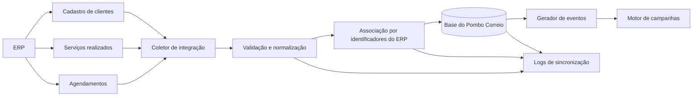
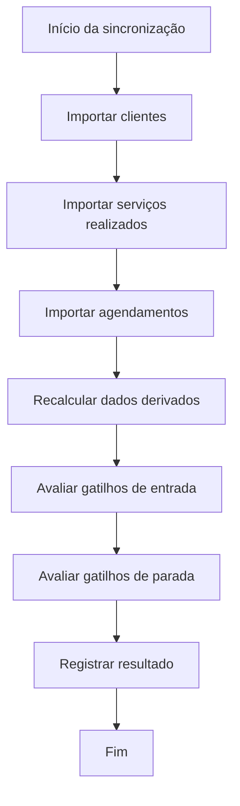
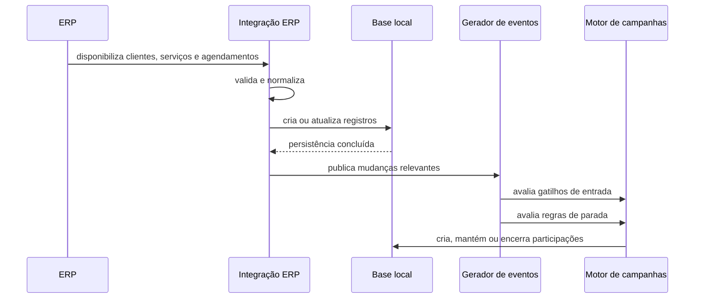
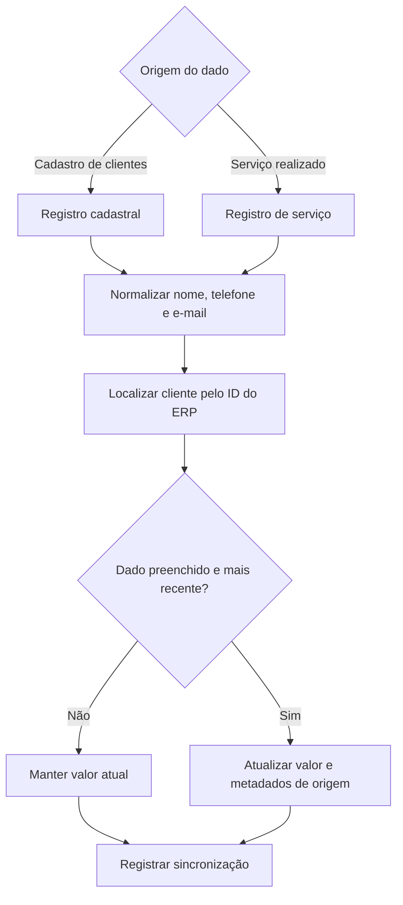
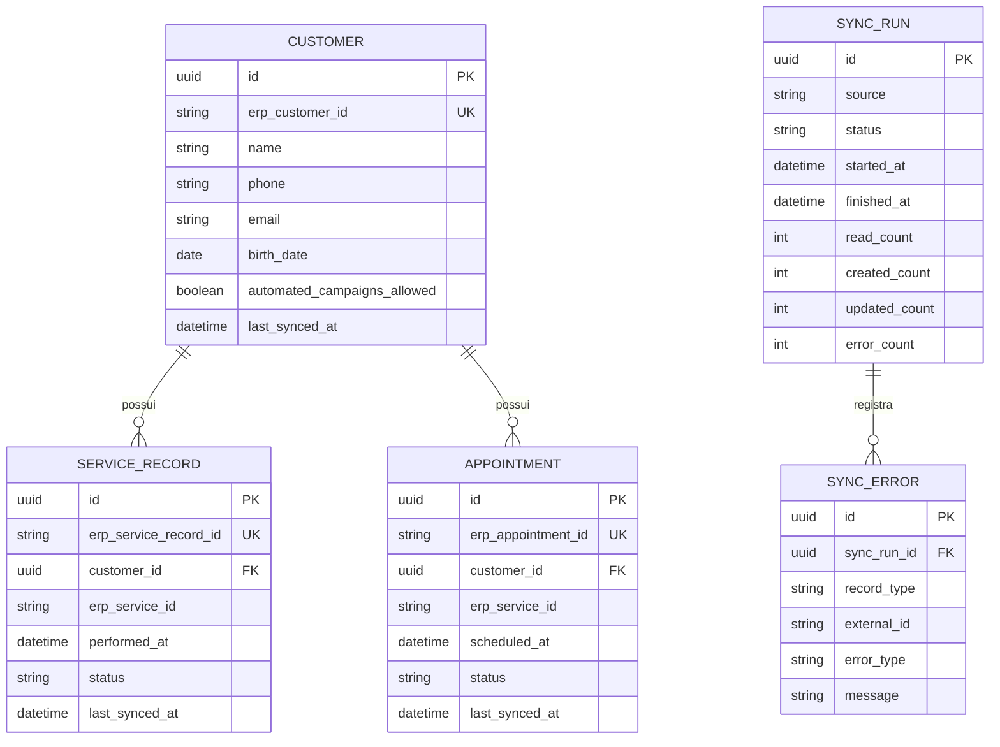

# Integração com o ERP

## 1. Objetivo

A integração com o ERP é responsável por fornecer ao Pombo Correio os dados necessários para:

- criar e atualizar clientes;
- identificar serviços realizados;
- identificar agendamentos futuros e alterações de agendamento;
- manter o histórico comercial usado pelas campanhas;
- gerar eventos de entrada e de parada das campanhas;
- atualizar dados de contato quando informações mais recentes forem encontradas;
- preservar a rastreabilidade da origem e da data de sincronização dos dados.

O ERP permanece como a fonte principal dos dados comerciais. O Pombo Correio não substitui o cadastro, o histórico de serviços nem a agenda do ERP. Ele mantém uma cópia local dos dados necessários para automação e consulta.

## 2. Escopo da integração no MVP

A integração deve consumir três conjuntos de dados disponibilizados pelo ERP:

1. **Cadastro de clientes**;
2. **Serviços realizados**;
3. **Agendamentos**.

Essas fontes podem ser disponibilizadas por API, consulta ao banco, arquivos, relatórios exportados ou outro mecanismo. O meio técnico definitivo ainda depende da capacidade do ERP e deve ser definido na implantação.

Independentemente do meio de transporte, as regras de tratamento, validação, associação e atualização descritas neste documento devem ser preservadas.

## 3. Visão geral da arquitetura



## 4. Princípios da integração

### 4.1. Fonte principal

O ERP é a fonte principal para:

- dados cadastrais do cliente;
- serviços realizados;
- datas dos atendimentos;
- agendamentos;
- cancelamentos ou alterações de agendamento, quando fornecidos;
- identificadores externos usados para associação.

O Pombo Correio é a fonte principal apenas para dados próprios da plataforma, como:

- ID interno do cliente;
- permissão para receber campanhas automáticas;
- bandeiras manuais;
- participações em campanhas;
- mensagens programadas e enviadas;
- timeline de automação;
- logs de sincronização.

### 4.2. ID interno

Cada cliente deve possuir um ID interno gerado pelo Pombo Correio.

O cadastro também deve manter o identificador do cliente no ERP. Esse identificador externo é usado para localizar o mesmo cliente nas sincronizações futuras e para relacionar os registros de serviços e agendamentos.

O telefone, o e-mail, o CPF/CNPJ ou o nome não devem ser usados como chave principal de associação.

### 4.3. Sem deduplicação no MVP

O Pombo Correio seguirá a base do ERP. Caso o ERP possua dois cadastros para a mesma pessoa, eles serão tratados como clientes distintos enquanto tiverem identificadores diferentes.

Não faz parte do MVP:

- detectar duplicidades;
- mesclar clientes;
- sugerir unificação de cadastros;
- alterar registros diretamente no ERP.

### 4.4. Idempotência

Executar a mesma sincronização mais de uma vez não deve duplicar clientes, serviços realizados, agendamentos ou eventos.

Cada registro importado deve possuir uma chave externa ou uma chave técnica determinística que permita reconhecer que aquele registro já foi processado.

Exemplos:

- cliente: `erp_customer_id`;
- serviço realizado: `erp_service_record_id`;
- agendamento: `erp_appointment_id`.

Caso o ERP não forneça identificadores próprios para serviços ou agendamentos, será necessário definir uma chave composta estável. Essa definição deve ser feita somente após conhecer os campos reais disponibilizados pelo ERP.

## 5. Frequência e modos de sincronização

A integração deve suportar dois modos conceituais:

### 5.1. Carga inicial

Executada na implantação para popular a base local com:

- todos os clientes disponíveis;
- histórico de serviços dentro do período acordado;
- agendamentos futuros e, quando necessário, agendamentos recentes.

A carga inicial deve ser executada antes da ativação das campanhas para evitar disparos baseados em uma base parcial.

### 5.2. Sincronização incremental

Executada periodicamente para buscar registros novos ou alterados desde a última sincronização bem-sucedida.

A periodicidade exata será definida conforme o mecanismo de acesso ao ERP. Como regra funcional, a integração deve buscar reduzir o intervalo entre uma alteração no ERP e sua disponibilidade no Pombo Correio.

Para o MVP, não é obrigatório operar em tempo real. O sistema pode trabalhar com execução agendada, desde que a frequência seja compatível com os gatilhos das campanhas.

### 5.3. Reprocessamento manual

A operação deve permitir reexecutar uma sincronização em caso de falha ou necessidade de correção.

O reprocessamento deve respeitar a idempotência e não gerar eventos duplicados.

## 6. Ordem recomendada de processamento

Em cada ciclo de sincronização, a ordem recomendada é:

1. cadastro de clientes;
2. serviços realizados;
3. agendamentos;
4. consolidação dos dados derivados do cliente;
5. geração de eventos para campanhas;
6. avaliação das regras de parada;
7. registro do resultado da sincronização.

Essa ordem reduz o risco de receber um serviço ou agendamento antes de o cliente correspondente existir na base local.



## 7. Integração do cadastro de clientes

### 7.1. Objetivo

Criar o cliente local quando ele ainda não existir e manter seus dados cadastrais sincronizados.

### 7.2. Campos esperados

A lista definitiva depende do relatório real do ERP, mas o módulo de Clientes atualmente precisa, quando disponíveis, de:

- identificador do cliente no ERP;
- nome;
- telefone;
- e-mail;
- data de nascimento;
- data de criação ou atualização no ERP, quando fornecida.

Campos não utilizados pelo MVP podem ser ignorados na importação.

### 7.3. Regra de criação

Ao receber um cliente cujo identificador do ERP ainda não existe:

1. gerar um ID interno;
2. salvar o identificador do ERP;
3. normalizar os dados de contato;
4. criar o cadastro local;
5. definir a permissão para campanhas automáticas com o valor padrão acordado para a implantação;
6. registrar a origem e a data da sincronização.

### 7.4. Regra de atualização

Ao receber um cliente já existente:

1. localizar pelo identificador do ERP;
2. comparar os campos sincronizáveis;
3. atualizar apenas os campos vindos do ERP;
4. preservar dados próprios do Pombo Correio;
5. registrar a data da última sincronização.

A sincronização nunca deve sobrescrever:

- permissão para campanhas automáticas;
- bandeiras manuais;
- histórico de campanhas;
- timeline;
- mensagens programadas ou enviadas.

### 7.5. Dados vazios

Um valor vazio recebido do ERP não deve apagar automaticamente um valor válido já existente sem uma regra explícita.

Regra recomendada para o MVP:

- valores preenchidos podem atualizar o cadastro;
- valores vazios são ignorados;
- a remoção intencional de um dado deve ser tratada futuramente, caso o ERP consiga sinalizá-la de forma confiável.

## 8. Atualização cadastral por serviços realizados

### 8.1. Motivação

O relatório de serviços realizados pode conter dados de contato mais recentes do que o cadastro principal do cliente. Isso pode acontecer quando o telefone ou o e-mail é atualizado durante o atendimento.

Por isso, a importação de serviços também deve poder atualizar o cadastro local.

### 8.2. Regra de precedência

Ao processar um serviço realizado:

1. localizar o cliente pelo identificador do ERP;
2. importar o serviço;
3. verificar se o registro contém nome, telefone ou e-mail;
4. comparar a data do serviço com a origem da informação atualmente armazenada;
5. atualizar o cadastro somente quando o dado recebido for preenchido e for considerado mais recente;
6. registrar internamente que a atualização teve origem no relatório de serviços.

A fonte mais recente deve prevalecer, independentemente de ser o cadastro de clientes ou o registro de serviço.

Quando o ERP não fornecer uma data de atualização cadastral, a data do serviço pode ser usada como referência temporal apenas para os campos presentes nesse registro.

### 8.3. Exemplo

- cadastro de clientes informa telefone `11911111111`;
- serviço realizado em 20/07/2026 informa telefone `11999999999`;
- o serviço é mais recente que a última origem conhecida do telefone;
- o cadastro local passa a usar `11999999999`.

Uma sincronização posterior do cadastro não deve restaurar automaticamente o telefone antigo se não houver evidência de que aquele cadastro foi atualizado depois do serviço.

### 8.4. Metadados recomendados por campo

Para os campos que podem vir de mais de uma fonte, recomenda-se manter:

- valor atual;
- origem do valor;
- data de referência da origem;
- data em que foi importado.

Exemplo conceitual:

```text
phone.value = 11999999999
phone.source = service_record
phone.source_date = 2026-07-20
phone.synced_at = 2026-07-21T08:00:00-03:00
```

## 9. Tratamento do telefone

### 9.1. Normalização

Antes de salvar, o telefone deve ser normalizado:

- remover espaços;
- remover parênteses;
- remover hífens;
- remover caracteres não numéricos;
- aplicar código do país conforme a regra da implantação;
- preservar o valor original apenas se for útil para auditoria técnica.

### 9.2. Validação

O sistema deve classificar o telefone pelo menos como:

- ausente;
- válido para tentativa de envio;
- inválido.

A validação inicial pode ser estrutural. A confirmação de existência no WhatsApp dependerá da integração com o provedor de WhatsApp.

### 9.3. Uso nas campanhas

Antes de programar ou enviar uma mensagem, o sistema deve verificar se existe um telefone válido.

Um telefone inválido não deve ser transformado em bandeira do cliente. A situação deve ser apresentada junto ao próprio campo de telefone.

## 10. Integração de serviços realizados

### 10.1. Objetivo

Registrar o histórico de serviços do cliente e gerar eventos confiáveis para campanhas e regras de parada.

### 10.2. Campos esperados

Quando disponíveis:

- identificador do registro no ERP;
- identificador do cliente no ERP;
- identificador ou código do serviço;
- nome ou descrição do serviço;
- data e hora do atendimento;
- situação do atendimento;
- dados de contato presentes no atendimento;
- data de criação ou atualização do registro.

### 10.3. Associação com o cliente

O serviço deve ser associado pelo identificador do cliente no ERP.

Caso o cliente ainda não exista localmente:

- o sistema pode criar um cadastro mínimo, se o registro fornecer dados suficientes; ou
- manter o serviço pendente até a importação do cadastro de clientes.

Para o MVP, recomenda-se primeiro tentar importar o cadastro de clientes e, se ainda assim o cliente não existir, registrar o serviço como pendente e gerar um erro operacional visível.

### 10.4. Associação com o catálogo de serviços

O código ou identificador do serviço no ERP deve ser vinculado ao serviço correspondente no catálogo do Pombo Correio.

Caso não exista vínculo:

- o histórico pode ser importado com a referência externa;
- campanhas dependentes daquele serviço não devem ser acionadas;
- a integração deve registrar uma pendência de mapeamento.

### 10.5. Estado válido para gerar evento

Somente registros em um estado considerado concluído ou realizado devem gerar o evento de serviço realizado.

A lista exata de estados depende do ERP e deverá ser mapeada na implantação.

Estados cancelados, excluídos, em aberto ou não concluídos não devem acionar campanhas de pós-venda.

### 10.6. Alterações posteriores

Caso um serviço anteriormente importado seja alterado:

- os dados locais devem ser atualizados;
- um evento já consumido não deve ser duplicado;
- se o estado mudar de não concluído para concluído, o evento deve ser gerado uma única vez;
- se o estado mudar de concluído para cancelado, o sistema deve registrar a alteração e avaliar os impactos nas campanhas conforme regra futura.

## 11. Integração de agendamentos

### 11.1. Objetivo

Manter o próximo agendamento do cliente atualizado e permitir que campanhas sejam interrompidas quando um novo agendamento relevante for identificado.

### 11.2. Campos esperados

Quando disponíveis:

- identificador do agendamento no ERP;
- identificador do cliente no ERP;
- data e hora do agendamento;
- situação;
- identificador ou nome do serviço;
- data de criação ou atualização.

### 11.3. Estados do agendamento

Os estados reais devem ser mapeados para estados internos, por exemplo:

- agendado;
- confirmado;
- cancelado;
- realizado;
- ausente;
- remarcado.

Para calcular o próximo agendamento, devem ser considerados apenas os estados definidos como futuros e válidos, normalmente `agendado` e `confirmado`.

### 11.4. Próximo agendamento

Depois de importar os agendamentos, o sistema deve calcular o agendamento válido mais próximo no futuro para cada cliente.

Caso não exista agendamento futuro válido, o campo deve permanecer vazio.

### 11.5. Novo agendamento como evento

Quando um agendamento válido for criado ou passar de um estado inválido para válido, o sistema deve gerar um evento de novo agendamento.

Esse evento pode:

- adicionar a bandeira automática de agendamento marcado;
- interromper campanhas que tenham essa regra de parada;
- impedir a entrada em campanhas cujos filtros excluam clientes já agendados.

### 11.6. Cancelamento e remarcação

Quando um agendamento for cancelado:

- atualizar o registro local;
- recalcular o próximo agendamento;
- remover a bandeira automática caso não exista outro agendamento válido;
- registrar o evento na timeline.

Quando um agendamento for remarcado, o sistema deve atualizar o registro existente quando o ERP preservar o mesmo identificador. Caso o ERP crie um novo registro, o mapeamento deve evitar interpretar a remarcação como dois agendamentos ativos.

## 12. Consolidação dos dados do cliente

Após importar as três fontes, o sistema deve recalcular:

- último atendimento e serviço correspondente;
- quantidade de dias desde o último atendimento;
- bandeira automática de faixa de tempo;
- próximo agendamento;
- bandeira automática de agendamento marcado;
- elegibilidade para campanhas que dependam desses dados.

O cálculo deve usar os registros locais já normalizados, e não depender diretamente da estrutura bruta do ERP.

## 13. Bandeiras automáticas dependentes do ERP

As bandeiras automáticas previstas para o módulo de Clientes são:

- faixas de tempo desde o último atendimento;
- agendamento marcado.

Exemplos de faixas:

- sem atendimento há 30 dias;
- sem atendimento há 90 dias;
- sem atendimento há 180 dias.

O cliente deve receber apenas a faixa mais alta aplicável, evitando bandeiras simultâneas de 30, 90 e 180 dias.

Os períodos exatos podem ser fixos no MVP e configuráveis futuramente.

## 14. Eventos gerados pela integração

A integração não deve apenas copiar dados. Ela deve gerar eventos internos quando ocorrer uma mudança relevante.

Eventos previstos:

- cliente criado;
- cliente atualizado;
- serviço realizado;
- agendamento criado;
- agendamento alterado;
- agendamento cancelado;
- próximo agendamento alterado.

Nem todo evento precisa aparecer na timeline. Eventos puramente técnicos podem ficar apenas nos logs.

Eventos usados por campanhas devem possuir uma chave de idempotência para garantir consumo único.

## 15. Relação com o motor de campanhas



### 15.1. Gatilhos de entrada

Exemplos dependentes do ERP:

- serviço realizado;
- cliente sem atendimento há determinado período;
- primeira ocorrência futura de outro evento suportado.

### 15.2. Regras de parada

Exemplos dependentes do ERP:

- novo atendimento realizado;
- novo agendamento válido.

Antes de cada ação programada, o motor de campanhas deve verificar novamente as regras de parada com base nos dados atualizados.

### 15.3. Motivo obrigatório do encerramento

Quando uma participação for encerrada por um evento do ERP, o sistema deve registrar o motivo correspondente.

Exemplos:

- `Novo atendimento realizado`;
- `Novo agendamento identificado`.

O motivo deve aparecer na ficha do cliente, no histórico da campanha e na timeline.

## 16. Fluxo de atualização cadastral



## 17. Tratamento de erros

A falha de um registro não deve, sempre que possível, impedir o processamento de todos os outros registros.

Cada erro deve registrar:

- fonte;
- tipo de registro;
- identificador externo, quando disponível;
- data e hora;
- mensagem técnica;
- classificação do erro;
- possibilidade de reprocessamento.

Classificações recomendadas:

- erro de conexão;
- erro de autenticação;
- formato inválido;
- campo obrigatório ausente;
- cliente não encontrado;
- serviço não mapeado;
- identificador duplicado na fonte;
- falha de persistência;
- erro inesperado.

## 18. Resultado de cada sincronização

Cada execução deve registrar:

- início e fim;
- status: concluída, concluída com alertas ou falhou;
- fonte processada;
- quantidade lida;
- quantidade criada;
- quantidade atualizada;
- quantidade ignorada;
- quantidade com erro;
- data de referência usada na busca incremental;
- identificador da execução.

Esses dados não exigem um dashboard no MVP, mas devem estar disponíveis para suporte e diagnóstico.

## 19. Segurança e acesso

A integração deve:

- utilizar credenciais específicas para o Pombo Correio;
- solicitar apenas as permissões necessárias;
- proteger credenciais em armazenamento seguro;
- não registrar senhas ou tokens em logs;
- usar conexão criptografada quando o mecanismo permitir;
- limitar o acesso aos dados importados aos usuários autorizados.

A forma exata de autenticação depende do ERP.

## 20. Dados históricos e janela de importação

A carga inicial deve definir uma janela histórica de serviços suficiente para:

- mostrar o último atendimento;
- calcular bandeiras de tempo;
- iniciar campanhas de reativação quando aplicável.

Importar todo o histórico pode ser desnecessário. A janela deve considerar a maior faixa de tempo usada pelas campanhas e bandeiras, acrescida de uma margem operacional.

Agendamentos devem incluir todos os registros futuros necessários e uma pequena janela passada para detectar alterações recentes, cancelamentos ou remarcações.

## 21. Modelo conceitual mínimo



Esse modelo é conceitual e poderá ser adaptado à tecnologia escolhida.

## 22. Critérios de aceite

A integração será considerada funcional para o MVP quando:

1. importar clientes sem duplicá-los em reprocessamentos;
2. atualizar dados cadastrais sem sobrescrever configurações próprias do Pombo Correio;
3. atualizar telefone e e-mail a partir de serviços mais recentes, quando disponíveis;
4. normalizar e validar telefones;
5. importar serviços realizados e associá-los ao cliente correto;
6. importar agendamentos e calcular o próximo agendamento válido;
7. recalcular último atendimento e bandeiras automáticas;
8. gerar eventos de serviço realizado e novo agendamento uma única vez;
9. permitir que esses eventos iniciem ou encerrem participações em campanhas;
10. registrar motivo em todo encerramento provocado pela integração;
11. registrar o resultado e os erros de cada sincronização;
12. permitir reprocessamento sem duplicação de dados ou eventos.

## 23. Fora do escopo do MVP

- escrita de dados de volta no ERP;
- correção cadastral diretamente no Pombo Correio para campos sincronizados;
- deduplicação e mesclagem de clientes;
- sincronização obrigatoriamente em tempo real;
- exclusão ou inativação automática de clientes;
- importação de dados comerciais que não sejam necessários às campanhas;
- dashboard avançado de integração;
- resolução automática de conflitos complexos;
- suporte genérico a qualquer ERP sem mapeamento prévio.

## 24. Pontos que dependem do ERP

Os seguintes itens só podem ser fechados após analisar os relatórios ou a interface técnica real do ERP:

- meio de acesso: API, banco, arquivo ou relatório;
- autenticação;
- frequência máxima permitida;
- paginação e limites;
- identificadores disponíveis;
- campos exatos de cada fonte;
- datas de criação e atualização;
- estados de serviços e agendamentos;
- forma de representar cancelamentos e remarcações;
- existência de dados de contato nos serviços realizados;
- existência de consultas incrementais;
- formato de datas, telefones e códigos;
- comportamento quando registros são removidos no ERP.

Esses pontos devem ser documentados em um mapeamento específico do ERP quando a fonte real estiver disponível.

## 25. Decisão central

A integração deve transformar os relatórios do ERP em uma base local confiável e em eventos idempotentes.

O fluxo esperado é:

```text
ERP
  -> coleta
  -> validação
  -> normalização
  -> associação por identificadores
  -> persistência local
  -> consolidação do cliente
  -> geração de eventos
  -> entrada ou parada de campanhas
  -> registro de auditoria
```

O objetivo não é replicar todo o ERP. É coletar apenas os dados necessários para que o Pombo Correio saiba:

- quem é o cliente;
- como contatá-lo;
- qual serviço ele realizou;
- quando ocorreu o atendimento;
- se possui um agendamento futuro;
- quando deve entrar ou sair de uma campanha.
