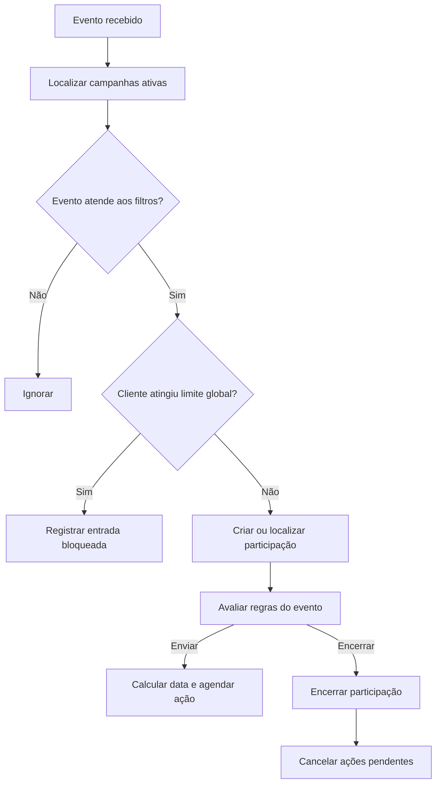
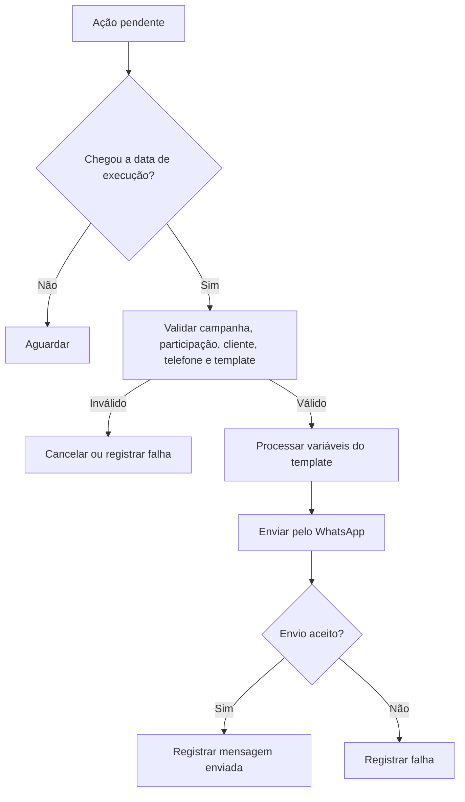
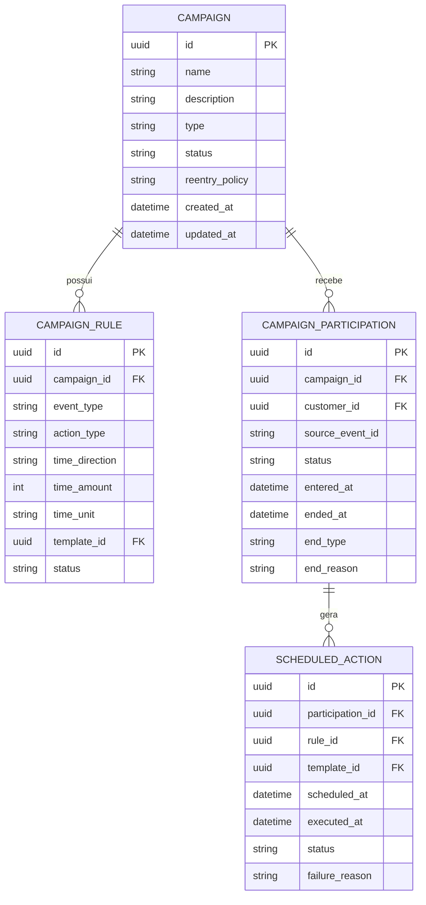

# Módulo de Campanhas

## 1. Visão geral

O módulo de Campanhas é o núcleo de automação do Pombo Correio.

Uma campanha representa um conjunto de regras independentes que executam ações com base em eventos originados no ERP ou no próprio sistema.

Cada regra segue a estrutura:

```text
Evento
  ↓
Deslocamento de tempo, quando aplicável
  ↓
Ação
```

A campanha não precisa ser um fluxo linear em que uma ação depende da anterior. As regras podem ser avaliadas e agendadas de forma independente, desde que pertençam à mesma campanha.

Exemplo:

- serviço realizado;
- enviar uma mensagem após 2 dias;
- enviar outra mensagem após 15 dias;
- enviar outra mensagem após 30 dias;
- encerrar a participação caso um novo serviço seja realizado.

## 2. Objetivo

O módulo deve permitir:

- criar campanhas automáticas baseadas em serviços realizados ou agendamentos;
- configurar múltiplas regras dentro da mesma campanha;
- programar mensagens antes ou depois de um evento, quando permitido;
- selecionar um template para cada ação de envio;
- encerrar participações automaticamente quando ocorrer um evento de parada;
- cancelar ações pendentes após o encerramento;
- registrar o motivo de todo encerramento;
- controlar a reentrada do cliente na campanha;
- respeitar o limite global de campanhas simultâneas por cliente;
- preparar a arquitetura para campanhas de disparo em massa.

## 3. Estrutura da campanha

Cada campanha deve possuir:

- ID interno único;
- nome;
- descrição opcional;
- status;
- tipo;
- uma ou mais regras;
- configuração de reentrada;
- data de criação;
- data da última atualização.

## 4. Status da campanha

No MVP, a campanha poderá possuir os seguintes estados:

- **Ativa**: pode receber novas participações e executar ações;
- **Inativa**: não recebe novas participações e não cria novos agendamentos de ação.

O comportamento das participações já existentes ao inativar uma campanha deve ser definido de forma explícita na implementação. Como regra segura, nenhuma nova ação deve ser executada enquanto a campanha estiver inativa.

## 5. Tipos de campanha

### 5.1. Campanha automática

É acionada por eventos do ERP.

Eventos previstos no MVP:

- serviço realizado;
- agendamento.

### 5.2. Campanha de disparo em massa

Deve ficar prevista na arquitetura, mas pode ser implementada após o MVP.

Nesse modo:

- o público é selecionado manualmente;
- não existe evento de entrada automático;
- as ações continuam utilizando templates;
- o envio deve respeitar permissão do cliente, telefone válido e limites operacionais;
- o sistema deve registrar quais clientes foram impactados.

## 6. Regras da campanha

Uma campanha possui uma ou mais regras independentes.

Cada regra deve conter:

- ID interno;
- campanha;
- evento;
- filtros do evento;
- deslocamento temporal, quando aplicável;
- ação;
- configuração específica da ação;
- status da regra.

A regra é a unidade executável do motor de campanhas.

## 7. Eventos

Eventos representam acontecimentos que podem gerar uma ação.

### 7.1. Serviço realizado

Representa um atendimento já concluído.

Pode ser filtrado por:

- um ou mais serviços;
- uma ou mais categorias de serviço.

Regras importantes:

- permite ações apenas após o evento;
- nunca permite envio antes da realização;
- deve ser gerado somente para atendimentos considerados realizados ou concluídos pela integração;
- o mesmo evento não pode ser consumido duas vezes pela mesma regra.

Exemplo:

```text
Evento: Serviço realizado
Serviço: Unha em Gel
Tempo: 2 dias depois
Ação: Enviar template Pós-venda
```

### 7.2. Agendamento

Representa um compromisso futuro ou um agendamento identificado pelo ERP.

Pode ser filtrado por:

- um ou mais serviços;
- uma ou mais categorias de serviço.

Permite ações:

- antes do horário agendado;
- no horário do agendamento;
- depois do horário agendado.

Exemplo:

```text
Evento: Agendamento
Tempo: 2 dias antes
Ação: Enviar template Lembrete
```

Outro exemplo:

```text
Evento: Agendamento
Tempo: 1 dia depois
Ação: Enviar template Pós-agendamento
```

A interpretação de "depois" dependerá do dado disponível no ERP. Caso o ERP não informe que o agendamento foi realizado, a regra estará relacionada apenas ao horário agendado, e não à confirmação da realização.

### 7.3. Novo serviço realizado

Pode ser usado como evento de parada.

Representa a ocorrência de outro serviço realizado após a entrada do cliente na campanha.

A ação normalmente associada será:

```text
Encerrar participação
Motivo: Novo serviço realizado
```

### 7.4. Novo agendamento

Pode ser usado como evento de parada.

Representa um novo agendamento válido identificado após a entrada do cliente na campanha.

A ação normalmente associada será:

```text
Encerrar participação
Motivo: Novo agendamento identificado
```

## 8. Deslocamento temporal

O tempo deve ser armazenado como deslocamento relativo ao evento.

Exemplos:

| Evento | Deslocamento | Resultado |
|---|---:|---|
| Serviço realizado | +2 dias | Enviar 2 dias após a realização |
| Serviço realizado | +15 dias | Enviar 15 dias após a realização |
| Agendamento | -2 dias | Enviar 2 dias antes do agendamento |
| Agendamento | 0 | Enviar no horário definido |
| Agendamento | +1 dia | Enviar 1 dia após o agendamento |

O deslocamento deve conter:

- direção: antes, no momento ou depois;
- quantidade;
- unidade: minutos, horas ou dias.

Regras:

- ações de envio sempre exigem um tempo configurado;
- envio imediato deve ser representado por deslocamento zero;
- serviço realizado não aceita deslocamento negativo;
- agendamento aceita deslocamento negativo, zero ou positivo;
- a data calculada deve considerar o fuso horário configurado para a empresa.

## 9. Ações

No MVP, existirão dois tipos principais de ação.

### 9.1. Enviar mensagem

Executa o envio de uma mensagem por meio do WhatsApp.

Campos obrigatórios:

- evento;
- deslocamento temporal;
- template;
- canal, inicialmente WhatsApp.

O template deve ser referenciado pelo ID interno único.

Antes do envio, o sistema deve validar:

- campanha ativa;
- participação ativa;
- ação ainda pendente;
- cliente autorizado a receber campanhas;
- telefone disponível e válido;
- template ativo;
- variáveis obrigatórias disponíveis;
- limite de campanhas simultâneas;
- ocorrência de algum evento de parada.

A mensagem enviada deve armazenar o conteúdo final processado, preservando o histórico mesmo que o template seja alterado posteriormente.

### 9.2. Encerrar participação

Finaliza a participação do cliente na campanha.

Campos obrigatórios:

- evento que provoca o encerramento;
- motivo padronizado.

Ao executar:

1. marcar a participação como encerrada;
2. cancelar todas as ações futuras ainda pendentes;
3. registrar data e hora;
4. registrar se o encerramento foi automático ou manual;
5. registrar o motivo;
6. registrar a regra que causou o encerramento;
7. incluir o evento na timeline do cliente.

Exemplos de motivos:

- novo serviço realizado;
- novo agendamento identificado;
- campanhas automáticas desativadas para o cliente;
- encerramento manual;
- campanha inativada;
- limite ou regra operacional acionada.

## 10. Exemplo de campanha de pós-venda

### Dados

```text
Nome: Pós-venda Unha em Gel
Status: Ativa
Tipo: Automática
```

### Regra 1

```text
Evento: Serviço realizado
Serviço: Unha em Gel
Tempo: 2 dias depois
Ação: Enviar mensagem
Template: Pesquisa de satisfação
```

### Regra 2

```text
Evento: Serviço realizado
Serviço: Unha em Gel
Tempo: 15 dias depois
Ação: Enviar mensagem
Template: Oferta de retorno
```

### Regra 3

```text
Evento: Serviço realizado
Serviço: Unha em Gel
Tempo: 30 dias depois
Ação: Enviar mensagem
Template: Lembrete de manutenção
```

### Regra 4

```text
Evento: Novo serviço realizado
Ação: Encerrar participação
Motivo: Novo serviço realizado
```

### Execução esperada

Ao importar o serviço realizado:

- o cliente entra na campanha;
- são criadas ações pendentes para 2, 15 e 30 dias;
- o sistema passa a observar eventos de parada.

Caso o cliente realize outro serviço no décimo dia:

- a mensagem de 2 dias permanece no histórico;
- a participação é encerrada;
- as mensagens de 15 e 30 dias são canceladas;
- o motivo fica registrado.

## 11. Exemplo de campanha de lembrete de agendamento

### Regra 1

```text
Evento: Agendamento
Tempo: 2 dias antes
Ação: Enviar mensagem
Template: Lembrete de agendamento
```

### Regra 2

```text
Evento: Agendamento
Tempo: 1 dia antes
Ação: Enviar mensagem
Template: Confirmação de agendamento
```

### Regra 3

```text
Evento: Novo agendamento ou cancelamento relevante
Ação: Encerrar ou recalcular ações pendentes
```

O tratamento de remarcação deve usar os dados sincronizados do ERP. Quando a data do agendamento mudar, as ações futuras relacionadas devem ser recalculadas para a nova data.

## 12. Participação do cliente

Cada entrada do cliente em uma campanha gera uma participação própria.

Campos mínimos:

- ID;
- cliente;
- campanha;
- evento de origem;
- registro do ERP que originou a entrada;
- data de entrada;
- status;
- data de encerramento;
- tipo de encerramento;
- motivo do encerramento.

Status previstos:

- ativa;
- concluída;
- encerrada;
- bloqueada;
- com erro.

## 13. Ações programadas

Cada regra de envio deve gerar uma ação programada para a participação.

Campos mínimos:

- ID;
- participação;
- regra;
- template;
- data calculada de execução;
- status;
- data de execução;
- mensagem gerada;
- motivo de cancelamento ou falha.

Status previstos:

- pendente;
- enviada;
- cancelada;
- falhou;
- ignorada.

## 14. Reentrada na campanha

A configuração de reentrada pertence à campanha.

Opções recomendadas para o MVP:

- não permitir nova participação;
- permitir nova participação após o encerramento anterior.

A arquitetura pode prever futuramente:

- permitir nova participação após determinado período;
- permitir uma participação para cada novo serviço ou agendamento.

O sistema não deve permitir duas participações simultâneas do mesmo cliente na mesma campanha, salvo configuração futura explícita.

## 15. Limite global de campanhas simultâneas

O limite de campanhas simultâneas por cliente é uma configuração global do sistema.

Exemplo:

```text
Máximo de campanhas simultâneas por cliente: 3
```

Ao tentar inserir o cliente em uma nova campanha quando o limite já foi atingido:

- não encerrar campanhas existentes;
- não criar a nova participação;
- registrar que a entrada foi bloqueada;
- informar a campanha que tentou realizar a entrada;
- registrar o motivo: limite de campanhas simultâneas atingido.

Uma fila de espera pode ser avaliada futuramente, mas não faz parte da regra inicial.

## 16. Disparo em massa

O mecanismo deve ficar previsto como uma modalidade de campanha.

Características:

- seleção manual do público;
- uso de filtros de clientes e bandeiras;
- escolha de template;
- programação do envio;
- registro individual de cada cliente impactado;
- respeito ao bloqueio de campanhas do cliente;
- respeito à validação de telefone;
- controle de volume e processamento em lotes;
- prevenção de duplicidade de envio.

O disparo em massa não depende de evento de ERP para iniciar.

## 17. Listagem de campanhas

A listagem deve apresentar no mínimo:

- nome;
- tipo;
- status.

Recursos mínimos:

- busca por nome;
- filtro por status;
- filtro por tipo;
- atalho para abrir a campanha.

Métricas avançadas não são obrigatórias na listagem do MVP.

## 18. Tela de detalhes

A tela da campanha deve ser organizada em áreas ou abas.

### 18.1. Dados

- nome;
- descrição;
- status;
- tipo;
- configuração de reentrada.

### 18.2. Regras

- evento;
- filtros do evento;
- deslocamento temporal;
- ação;
- template, quando aplicável;
- status da regra.

### 18.3. Participações

- cliente;
- status;
- data de entrada;
- próxima ação;
- data da próxima ação;
- data de encerramento;
- motivo do encerramento;
- atalho para o cliente.

### 18.4. Histórico

- mensagens enviadas;
- ações canceladas;
- falhas;
- entradas bloqueadas;
- encerramentos manuais e automáticos.

## 19. Fluxo de execução



## 20. Fluxo do envio



## 21. Modelo conceitual



## 22. Regras de negócio consolidadas

1. Uma campanha possui uma ou mais regras independentes.
2. Toda regra possui um evento e uma ação.
3. Ação de envio sempre exige template e deslocamento temporal.
4. Serviço realizado permite envio apenas depois do evento.
5. Agendamento permite envio antes, no momento ou depois.
6. Deslocamento zero representa envio imediato ou no momento do evento.
7. Ação de encerramento exige evento e motivo.
8. Encerrar uma participação cancela todas as ações futuras pendentes.
9. Todo encerramento deve ser rastreável.
10. Templates são vinculados pelo ID interno, nunca pelo nome.
11. Eventos e ações devem ser idempotentes.
12. A mesma regra não pode consumir duas vezes o mesmo evento.
13. A reentrada pertence à campanha.
14. O limite de campanhas simultâneas pertence à configuração global.
15. Atingir o limite não encerra campanhas existentes.
16. O sistema deve prever disparo em massa sem misturá-lo ao evento automático do ERP.
17. Antes de enviar, todas as condições devem ser revalidadas.
18. Mensagens enviadas preservam o conteúdo final processado.

## 23. Critérios de aceite do MVP

O módulo será considerado funcional quando:

1. permitir criar campanha com nome e status;
2. permitir cadastrar múltiplas regras;
3. permitir usar serviço realizado como evento;
4. permitir usar agendamento como evento;
5. permitir filtrar eventos por serviço ou categoria;
6. permitir configurar envio após serviço realizado;
7. impedir envio antes de serviço realizado;
8. permitir envio antes ou depois de agendamento;
9. exigir template em toda ação de envio;
10. calcular corretamente a data de execução;
11. criar ações pendentes para cada regra aplicável;
12. executar ações sem duplicidade;
13. permitir encerrar por novo serviço ou novo agendamento;
14. cancelar ações pendentes após encerramento;
15. registrar motivo do encerramento;
16. exibir participações e ações na campanha;
17. respeitar a política de reentrada;
18. respeitar o limite global de campanhas simultâneas;
19. registrar entradas bloqueadas pelo limite;
20. manter a arquitetura preparada para disparo em massa.

## 24. Fora do escopo do MVP

- editor visual avançado com ramificações;
- condições booleanas complexas;
- ações diferentes de enviar mensagem e encerrar participação;
- respostas do WhatsApp como evento;
- leitura da mensagem como evento;
- múltiplos canais;
- inteligência artificial;
- fila automática para campanhas bloqueadas pelo limite;
- otimização automática de horário de envio;
- testes A/B;
- versionamento completo de campanhas;
- métricas avançadas de conversão.

## 25. Decisões futuras

- comportamento exato ao inativar campanha com participações ativas;
- janela permitida de horário para envios;
- tratamento detalhado de remarcações;
- definição de agendamento realizado quando o ERP não fornecer esse estado;
- política de repetição após falha temporária;
- configuração global do limite simultâneo;
- experiência de seleção de público no disparo em massa;
- novas ações, como adicionar bandeira ou iniciar outra campanha.
