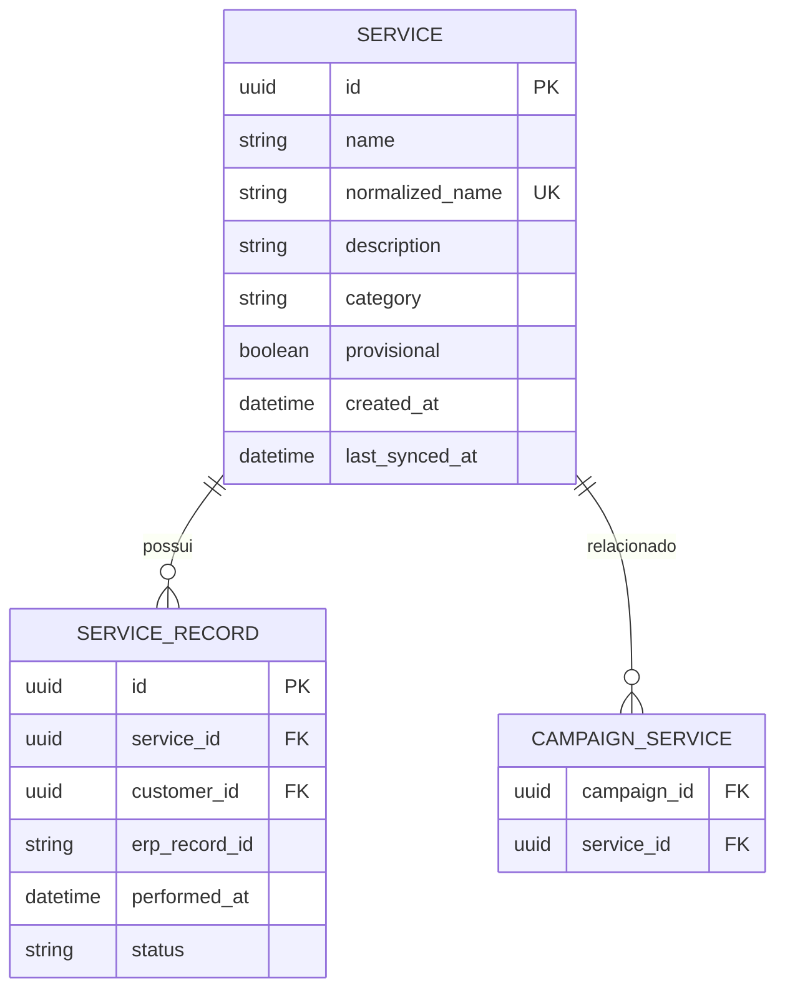
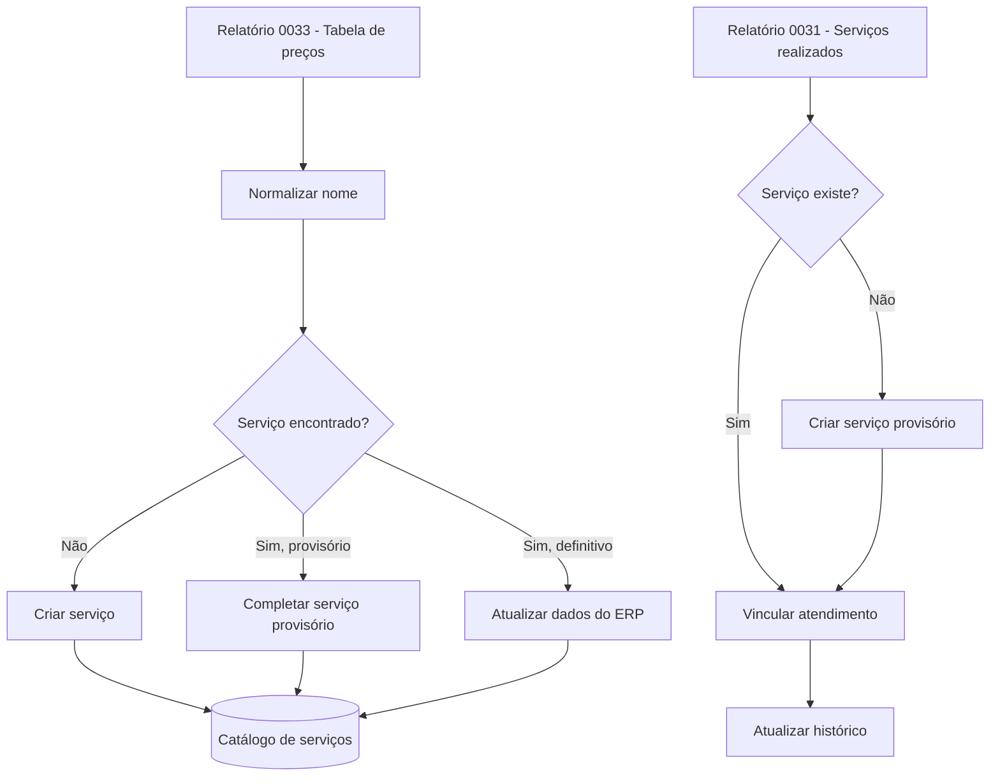

# Módulo de Serviços

## 1. Objetivo

O módulo de Serviços representa, dentro do Pombo Correio, o catálogo de serviços consumido do ERP.

Ele não substitui o cadastro do ERP e não permite criação, edição ou exclusão manual de serviços. Sua função é:

- disponibilizar os serviços para consulta;
- permitir que serviços e categorias sejam usados em gatilhos e filtros de campanhas;
- consolidar o histórico de atendimentos associados a cada serviço;
- mostrar as campanhas relacionadas ao serviço;
- preservar os vínculos com atendimentos e campanhas quando um serviço provisório for completado por uma sincronização posterior.

O ERP permanece como fonte de verdade para nome, descrição e categoria.

## 2. Fonte principal

O relatório **0033 — Tabela de preços dos serviços** é a fonte principal para criação e atualização do catálogo de serviços.

Embora o relatório contenha o valor do serviço, esse campo não será utilizado nem exibido pelo Pombo Correio.

Campos utilizados no MVP:

- nome do serviço;
- descrição, quando preenchida;
- categoria.

Campos ignorados:

- valor;
- demais informações que não sejam necessárias para campanhas ou consulta.

## 3. Identidade do serviço

### 3.1. ID interno

Cada serviço deve possuir um ID interno gerado pelo Pombo Correio.

Esse ID é usado internamente para:

- associar atendimentos ao serviço;
- associar campanhas ao serviço;
- preservar vínculos quando os dados sincronizados forem atualizados;
- evitar que relacionamentos internos dependam diretamente do texto exibido na interface.

O ID interno não precisa aparecer para o usuário.

### 3.2. Ausência de identificador do ERP

Até o momento, os relatórios analisados não apresentam um identificador estável do serviço no ERP.

Por isso, a identificação inicial será feita pelo nome normalizado.

Exemplo:

```text
" Unha em Gel "
"UNHA EM GEL"
"unha em gel"
```

Todos devem resultar na mesma chave normalizada:

```text
unha em gel
```

A normalização deve, no mínimo:

- remover espaços no início e no fim;
- reduzir espaços duplicados;
- padronizar letras maiúsculas e minúsculas;
- tratar caracteres equivalentes de forma consistente.

Não deve existir correspondência aproximada no MVP. Nomes diferentes, como `Alongamento Gel` e `Alongamento em Gel`, devem ser tratados como serviços distintos para evitar associações incorretas.

Nenhum código ou chave técnica de vinculação deve ser exibido na interface do módulo.

## 4. Regra de criação e atualização

### 4.1. Criação pelo relatório 0033

Quando um serviço do relatório 0033 ainda não existir:

1. gerar um ID interno;
2. salvar o nome original;
3. gerar a chave normalizada;
4. salvar a descrição, quando disponível;
5. salvar a categoria;
6. registrar a origem e a data da sincronização.

### 4.2. Atualização pelo relatório 0033

Quando o serviço já existir:

1. localizar pela chave normalizada;
2. atualizar nome, descrição e categoria com os dados do ERP;
3. preservar o ID interno;
4. preservar os atendimentos associados;
5. preservar as campanhas relacionadas;
6. registrar a data da última sincronização.

Nome, descrição e categoria são somente leitura no Pombo Correio. Qualquer correção deve ser realizada no ERP e refletida em uma sincronização posterior.

## 5. Serviço provisório

### 5.1. Quando criar

Um serviço provisório deve ser criado quando o relatório **0031 — Serviços realizados no período** apresentar um serviço que ainda não existe no catálogo sincronizado pelo relatório 0033.

### 5.2. Dados do provisório

O serviço provisório deve possuir internamente:

- ID interno;
- nome recebido no atendimento;
- chave normalizada;
- indicação técnica de que é provisório;
- data de criação;
- origem do registro.

Categoria e descrição podem permanecer vazias até a sincronização do relatório 0033.

### 5.3. Atualização posterior

Quando um serviço do relatório 0033 corresponder à chave normalizada de um serviço provisório:

1. atualizar o mesmo registro;
2. preencher descrição e categoria;
3. substituir o nome pela versão oficial do ERP;
4. retirar a indicação de provisório;
5. preservar todos os atendimentos e campanhas já associados.

Não deve ser criado um segundo serviço nessa situação.

### 5.4. Divergência de nomes

Se o nome do provisório não corresponder exatamente, após normalização, ao nome do relatório 0033, os registros permanecerão separados no MVP.

A resolução manual de serviços duplicados ou equivalentes não faz parte do escopo inicial.

## 6. Listagem de serviços

A listagem inicial deve apresentar somente:

- nome;
- categoria.

Recursos da listagem:

- busca por nome;
- filtro por categoria;
- ordenação por nome;
- ordenação por categoria;
- paginação, caso necessária;
- acesso à ficha do serviço.

Não devem aparecer na listagem inicial:

- descrição;
- valor;
- situação do serviço;
- código ou chave de vinculação com o ERP;
- total de atendimentos;
- campanhas relacionadas;
- data da última sincronização;
- filtro por campanha;
- ações de edição, criação ou exclusão.

## 7. Tela de detalhes

A tela de detalhes deve ser somente leitura e dividida em três áreas.

### 7.1. Dados do serviço

Exibir:

- nome;
- categoria;
- descrição, quando disponível;
- data da última sincronização.

Não exibir:

- valor;
- situação do serviço;
- código ou chave técnica de vinculação com o ERP.

Quando o serviço ainda for provisório, a interface pode informar que os dados completos ainda não foram encontrados no catálogo do ERP.

### 7.2. Histórico de atendimentos

Exibir os atendimentos associados ao serviço.

Cada registro deve mostrar:

- cliente;
- data do atendimento;
- situação do atendimento;
- atalho para acessar o cadastro do cliente.

Não exibir:

- valor;
- profissional;
- unidade.

Filtros mínimos do histórico:

- período;
- situação do atendimento;
- busca por cliente, quando necessária.

### 7.3. Campanhas relacionadas

Exibir apenas:

- nome da campanha;
- status da campanha;
- atalho para acessar a campanha.

As campanhas relacionadas aparecem somente na ficha do serviço, nunca na listagem inicial.

Não é necessário mostrar:

- tipo de vínculo com a campanha;
- total de clientes impactados;
- métricas ou resultados da campanha.

## 8. Uso da categoria nas campanhas

As categorias sincronizadas do ERP devem ficar disponíveis para configuração de gatilhos e filtros de campanhas.

Exemplo:

```text
Gatilho: atendimento finalizado
Categoria: Manicure e Pedicure
```

Uma campanha configurada por categoria deve considerar todos os serviços atualmente associados àquela categoria.

Se um serviço mudar de categoria no ERP, a nova categoria deve ser usada nas avaliações futuras. Participações e eventos históricos não devem ser reescritos retroativamente.

## 9. Relação com campanhas

Um serviço pode estar relacionado a várias campanhas.

Uma campanha também pode utilizar vários serviços ou uma categoria inteira.

As regras de pós-venda, reativação, cross-sell e ofertas pertencem ao módulo de Campanhas, não ao cadastro de Serviços.

O módulo de Serviços fornece apenas os dados usados por essas regras.

## 10. Relação com atendimentos

O relatório 0031 alimenta o histórico de atendimentos dos serviços.

Ao importar um atendimento:

1. localizar o serviço pelo nome normalizado;
2. criar um serviço provisório quando não houver correspondência;
3. associar o atendimento ao ID interno do serviço;
4. preservar a associação em sincronizações futuras;
5. gerar eventos de campanha somente quando a situação do atendimento for válida para isso.

## 11. Modelo conceitual



## 12. Fluxo de sincronização



## 13. Regras de negócio

1. O relatório 0033 cria e atualiza o catálogo oficial.
2. O valor do serviço é ignorado.
3. Nenhum dado sincronizado pode ser editado no Pombo Correio.
4. Cada serviço possui um ID interno não exibido ao usuário.
5. A identificação é feita pelo nome normalizado enquanto não existir um identificador estável no ERP.
6. Nenhum código de vinculação com o ERP aparece na interface.
7. Correspondência aproximada não será usada no MVP.
8. Serviços ausentes no catálogo podem ser criados provisoriamente a partir de atendimentos.
9. O serviço provisório deve ser atualizado, e não duplicado, quando aparecer no relatório 0033.
10. O histórico de atendimentos deve permanecer associado ao mesmo ID interno.
11. A categoria poderá ser usada em gatilhos e filtros de campanhas.
12. O módulo não contém regras de cross-sell ou automação.
13. A listagem inicial mostra somente nome e categoria.
14. Campanhas relacionadas aparecem apenas na ficha do serviço e mostram nome, status e atalho.
15. O módulo não utiliza situação ativa ou inativa para serviços.

## 14. Critérios de aceite

O módulo será considerado funcional quando:

1. importar os serviços do relatório 0033;
2. ignorar o valor do serviço;
3. impedir edição manual dos dados sincronizados;
4. localizar serviços por nome normalizado;
5. criar serviços provisórios para atendimentos sem correspondência;
6. completar serviços provisórios em sincronizações posteriores;
7. preservar vínculos com atendimentos e campanhas;
8. listar somente nome e categoria na tela inicial;
9. oferecer busca por nome, filtro por categoria e ordenação;
10. não exibir situação, código do ERP, total de atendimentos ou campanhas na listagem inicial;
11. exibir na ficha os dados sincronizados, o histórico de atendimentos e as campanhas relacionadas;
12. disponibilizar categoria para uso futuro em campanhas;
13. permitir acesso direto da ficha do serviço ao cliente de cada atendimento;
14. permitir acesso direto da ficha do serviço às campanhas relacionadas.

## 15. Fora do escopo do MVP

- edição manual de serviços;
- criação manual de serviços;
- exclusão de serviços;
- situação ativa ou inativa de serviços;
- uso ou exibição de valores;
- exibição de código ou chave de vinculação com o ERP;
- histórico de preços;
- mesclagem de serviços duplicados;
- correspondência aproximada de nomes;
- regras de cross-sell dentro do serviço;
- filtro por campanha na listagem;
- total de atendimentos na listagem;
- campanhas relacionadas na listagem;
- relatórios analíticos avançados.