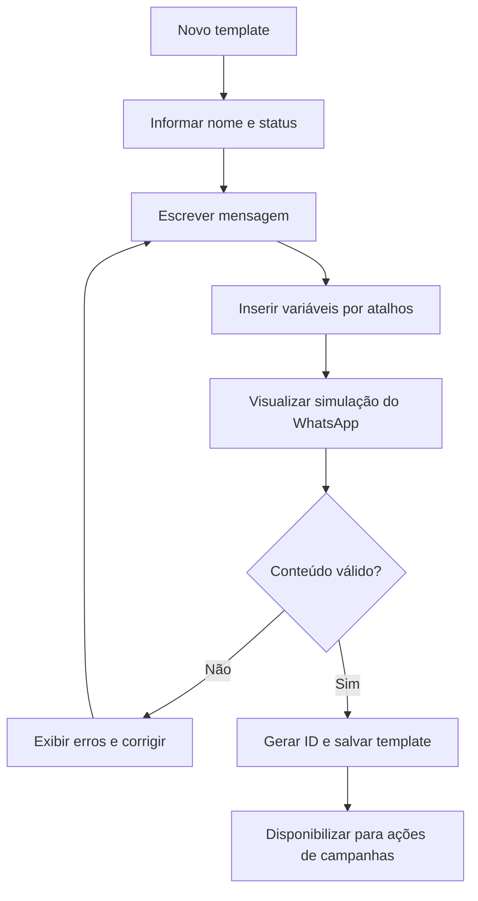
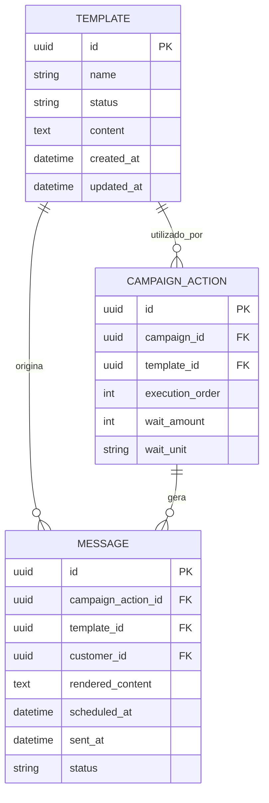

# Módulo de Templates

## 1. Visão geral

O módulo de Templates é responsável por criar e manter mensagens reutilizáveis que serão utilizadas nas ações das campanhas do Pombo Correio.

O template define apenas o conteúdo da mensagem. Ele não determina:

- qual cliente receberá a mensagem;
- quando a mensagem será enviada;
- qual evento iniciou o fluxo;
- quais regras de parada serão aplicadas;
- se o cliente poderá entrar novamente na campanha.

Essas decisões pertencem ao módulo de Campanhas.

A responsabilidade do módulo de Templates é responder às seguintes perguntas:

- Qual é o conteúdo da mensagem?
- Quais variáveis fixas são usadas?
- O conteúdo é válido?
- Como a mensagem será visualizada no WhatsApp?
- Qual identificador será utilizado pelas ações de campanha?

## 2. Princípios do módulo

### 2.1. Template é conteúdo reutilizável

Um mesmo template pode ser utilizado por uma ou mais ações de campanhas diferentes.

Exemplo:

```text
Template: Pós-venda padrão

Utilizado em:
- Campanha Pós-venda Unha
- Campanha Pós-venda Cabelo
- Campanha Pós-venda Estética
```

O vínculo entre a ação da campanha e o template deve ser feito pelo identificador interno do template, nunca pelo nome exibido.

### 2.2. O template não possui lógica de execução

O template não contém:

- gatilho de entrada;
- tempo de espera;
- filtros de público;
- regras de parada;
- telefone do destinatário;
- serviço obrigatório;
- agenda de envio.

Ele fornece somente a mensagem que será renderizada quando uma ação de campanha for executada.

### 2.3. Variáveis são fixas

As variáveis disponíveis são definidas pelo sistema.

O usuário pode inserir variáveis permitidas no conteúdo, mas não pode criar variáveis personalizadas no MVP.

Essa regra evita templates incompatíveis com os dados conhecidos pelo Pombo Correio.

## 3. Identificador único

Cada template deve possuir um identificador interno único, gerado automaticamente pelo Pombo Correio.

Exemplo conceitual:

```text
id: tpl_8f3a2c
nome: Pós-venda Unha
status: Ativo
```

### 3.1. Características do identificador

O identificador deve ser:

- único;
- imutável;
- gerado pelo sistema;
- não editável pelo usuário;
- utilizado pelas ações de campanhas;
- preservado quando o template for renomeado.

O identificador não precisa aparecer na listagem principal nem ocupar destaque na interface.

### 3.2. Vínculo com ações de campanhas

Cada ação de campanha deve armazenar a referência ao template pelo ID interno.

Exemplo conceitual:

```text
campaign_action.template_id = tpl_8f3a2c
```

O nome do template serve apenas para apresentação ao usuário.

Isso permite:

- renomear o template sem quebrar campanhas;
- manter vínculos estáveis;
- evitar ambiguidades entre templates com nomes semelhantes;
- rastrear qual template foi usado por cada ação.

## 4. Listagem de templates

A listagem deve ser simples e apresentar apenas:

- nome;
- status.

### 4.1. Recursos da listagem

A listagem deve permitir:

- busca por nome;
- filtro por status;
- ordenação por nome;
- acesso à tela de edição do template;
- criação de um novo template.

### 4.2. Status

Os status disponíveis no MVP são:

- Ativo;
- Inativo.

### 4.3. Informações que não aparecem na listagem

Não é necessário exibir:

- identificador interno;
- conteúdo completo;
- quantidade de campanhas relacionadas;
- data de criação;
- data da última edição;
- categoria;
- canal;
- quantidade de envios.

## 5. Cadastro e edição

A tela de criação e edição deve possuir:

- nome;
- status;
- editor de texto;
- atalhos para variáveis fixas;
- preview simulando o WhatsApp.

O identificador interno é gerado automaticamente na criação.

### 5.1. Nome

O nome é obrigatório e serve para localizar e selecionar o template nas ações das campanhas.

Exemplos:

- Pós-venda Unha;
- Reativação 90 dias;
- Lembrete de retorno;
- Confirmação de atendimento.

O nome pode ser alterado sem modificar o identificador interno e sem quebrar campanhas existentes.

### 5.2. Status

O usuário deve poder definir o template como Ativo ou Inativo.

Um template ativo pode ser selecionado em novas ações de campanhas.

Um template inativo:

- não deve aparecer como opção para novas ações;
- permanece vinculado às ações que já o utilizavam;
- não deve ser excluído do histórico;
- pode ser reativado posteriormente.

O comportamento exato de ações futuras que já referenciam um template tornado inativo deve ser validado pelo motor de campanhas antes da execução.

Como regra segura para o MVP, uma ação não deve enviar uma mensagem usando um template inativo sem validação explícita.

## 6. Editor de texto

O conteúdo da mensagem será criado em um editor de texto simples.

O editor deve suportar:

- texto comum;
- quebras de linha;
- emojis;
- links em texto;
- variáveis fixas;
- formatação textual compatível com a integração do WhatsApp, quando disponível.

Não é necessário um editor visual complexo no MVP.

### 6.1. Inserção de variáveis

A tela deve possuir atalhos com nomes amigáveis para inserir variáveis na posição atual do cursor.

Exemplo:

```text
Nome do cliente -> {{nome_cliente}}
Primeiro nome -> {{primeiro_nome}}
Serviço -> {{servico}}
Data do atendimento -> {{data_atendimento}}
Data do agendamento -> {{data_agendamento}}
Nome da empresa -> {{empresa}}
```

Ao clicar em um atalho:

1. a tag correspondente é inserida no editor;
2. a tag é posicionada onde está o cursor;
3. o preview é atualizado;
4. a variável passa a ser considerada na validação.

### 6.2. Digitação manual de variáveis

O usuário pode digitar uma tag manualmente, mas ela deve ser validada antes de salvar.

Exemplos inválidos:

```text
{{nome
{{nom_cliente}}
{{serviço}}
{{variavel_personalizada}}
```

O sistema deve informar qual variável ou sintaxe é inválida.

## 7. Variáveis fixas

As variáveis são predefinidas pelo Pombo Correio.

A lista inicial deve conter apenas dados que o sistema consiga preencher de forma confiável.

### 7.1. Variáveis iniciais recomendadas

#### Cliente

- `{{nome_cliente}}` — nome completo do cliente;
- `{{primeiro_nome}}` — primeiro nome do cliente.

#### Serviço e atendimento

- `{{servico}}` — nome do serviço relacionado ao evento;
- `{{data_atendimento}}` — data do atendimento relacionado.

#### Agendamento

- `{{data_agendamento}}` — data do próximo agendamento relacionado, quando aplicável.

#### Empresa

- `{{empresa}}` — nome da empresa configurado para a implantação.

### 7.2. Formatação de valores

As variáveis devem ser formatadas antes de substituir as tags.

Exemplos:

- datas em formato amigável, como `02/08/2026`;
- nomes sem espaços excedentes;
- primeiro nome extraído de forma consistente;
- serviço com o nome oficial sincronizado do ERP.

### 7.3. Variável sem valor

Caso uma variável usada no template não possua valor no contexto da ação, a mensagem não deve ser enviada com conteúdo incompleto.

Exemplos que devem ser evitados:

```text
Olá, !
Seu atendimento de  foi realizado em .
```

Antes do envio, o sistema deve:

1. identificar a variável sem valor;
2. impedir o envio;
3. registrar a falha ou pendência da ação;
4. informar qual variável não pôde ser preenchida.

## 8. Preview simulando o WhatsApp

A tela de edição deve possuir uma pré-visualização que simule a apresentação da mensagem no WhatsApp.

O preview deve ser atualizado em tempo real enquanto o usuário edita o conteúdo.

### 8.1. Elementos do preview

A simulação deve representar, de forma aproximada:

- área de conversa;
- balão de mensagem enviada;
- alinhamento da mensagem;
- quebras de linha;
- emojis;
- links;
- horário fictício;
- indicação visual de mensagem enviada;
- formatação textual suportada.

Não é necessário reproduzir toda a interface oficial do WhatsApp. O objetivo é permitir que o usuário compreenda como a mensagem ficará visualmente.

### 8.2. Dados fictícios

As variáveis devem ser substituídas por valores fictícios no preview.

Exemplo de template:

```text
Olá, {{primeiro_nome}}!

Seu atendimento de {{servico}} foi realizado em {{data_atendimento}}.
```

Exemplo de preview:

```text
Olá, Maria!

Seu atendimento de Unha em Gel foi realizado em 02/08/2026.
```

Valores fictícios sugeridos:

- nome do cliente: Maria Silva;
- primeiro nome: Maria;
- serviço: Unha em Gel;
- data do atendimento: 02/08/2026;
- data do agendamento: 15/08/2026;
- empresa: Empresa Exemplo.

### 8.3. Preview e envio real

O preview é apenas uma simulação.

O conteúdo real enviado deve ser renderizado no momento da execução da ação, utilizando os dados do cliente e do evento relacionado.

## 9. Validações

O template deve ser validado antes de ser salvo.

### 9.1. Validações obrigatórias

- nome preenchido;
- conteúdo preenchido;
- status válido;
- todas as tags possuem abertura e fechamento corretos;
- todas as variáveis pertencem à lista permitida;
- não existem tags incompletas;
- não existem variáveis personalizadas;
- o conteúdo pode ser renderizado no preview.

### 9.2. Exemplos de erros

```text
Erro: variável desconhecida {{nom_cliente}}
Erro: tag não finalizada {{nome_cliente
Erro: conteúdo obrigatório
Erro: nome obrigatório
```

### 9.3. Validação de compatibilidade com campanhas

Salvar um template válido não significa que ele seja compatível com qualquer campanha.

A campanha deve validar se o contexto do gatilho consegue fornecer todas as variáveis usadas.

Exemplo:

Um template utiliza:

```text
{{data_atendimento}}
```

Uma campanha sem atendimento relacionado não deve aceitar esse template sem apresentar um erro de compatibilidade.

## 10. Uso nas campanhas

Cada ação de campanha deve selecionar um template ativo.

Exemplo:

```text
Ação 1
Esperar: 1 dia
Template: Pós-venda Unha
Template ID: tpl_8f3a2c
```

### 10.1. Seleção

Na criação ou edição de uma ação, o sistema deve mostrar os templates ativos pelo nome.

Ao selecionar um template, a ação armazena o ID interno.

### 10.2. Alteração de nome

Renomear o template não altera:

- o ID interno;
- o vínculo com campanhas;
- as ações existentes;
- o histórico de mensagens enviadas.

### 10.3. Alteração de conteúdo

Quando o conteúdo de um template for alterado:

- ações futuras utilizarão o conteúdo atualizado, desde que o template continue válido e ativo;
- mensagens já enviadas não devem ser alteradas;
- mensagens já processadas devem preservar o texto final renderizado.

### 10.4. Template inativo

Um template inativo não deve ser selecionável em novas ações.

Para ações existentes, o motor de campanhas deve validar o status antes do envio.

Se o envio for bloqueado, deve registrar o motivo correspondente, por exemplo:

```text
Ação não executada: template inativo.
```

## 11. Histórico de mensagens

O template não precisa manter versões completas no MVP.

Para preservar o histórico, cada mensagem enviada deve armazenar:

- ID do template utilizado;
- nome do template no momento do processamento, quando útil;
- conteúdo final com as variáveis substituídas;
- data e hora do processamento;
- cliente;
- campanha;
- ação;
- status do envio.

Assim, alterações posteriores no template não modificam mensagens antigas.

## 12. Exclusão e inativação

Não deve existir exclusão definitiva de templates no MVP.

O usuário deve utilizar o status Inativo para retirar um template de uso.

Essa regra preserva:

- vínculos com campanhas;
- histórico de ações;
- histórico de mensagens;
- rastreabilidade.

## 13. Fluxo de criação e utilização



## 14. Relação com campanhas e mensagens



## 15. Estrutura sugerida da interface

```text
Templates
├── Listagem
│   ├── Nome
│   ├── Status
│   ├── Busca por nome
│   └── Filtro por status
│
└── Cadastro/Edição
    ├── Nome
    ├── Status
    ├── Editor de texto
    ├── Atalhos de variáveis
    └── Preview do WhatsApp
```

## 16. Regras de negócio consolidadas

1. Todo template possui ID interno único e imutável.
2. Ações de campanhas referenciam templates pelo ID, nunca pelo nome.
3. A listagem exibe apenas nome e status.
4. O conteúdo é criado em editor de texto simples.
5. Variáveis são fixas e definidas pelo sistema.
6. O usuário não cria variáveis personalizadas no MVP.
7. Atalhos inserem tags na posição atual do cursor.
8. Tags digitadas manualmente também são validadas.
9. O preview deve simular uma mensagem no WhatsApp.
10. O preview substitui variáveis por dados fictícios.
11. Template com sintaxe inválida não pode ser salvo.
12. A campanha valida se consegue fornecer todas as variáveis utilizadas.
13. Variável sem valor impede o envio da mensagem.
14. Templates inativos não aparecem para novas ações.
15. Templates não são excluídos definitivamente no MVP.
16. Renomear um template não quebra campanhas.
17. Mensagens já enviadas preservam o conteúdo renderizado.
18. Alterações no template afetam apenas processamentos futuros.

## 17. Critérios de aceite do MVP

O módulo será considerado funcional quando:

1. permitir criar template com nome, status e conteúdo;
2. gerar um ID único automaticamente;
3. listar templates por nome e status;
4. permitir busca por nome e filtro por status;
5. disponibilizar editor de texto;
6. oferecer atalhos para variáveis fixas;
7. inserir a variável na posição do cursor;
8. validar tags e variáveis desconhecidas;
9. apresentar preview em tempo real simulando o WhatsApp;
10. substituir variáveis por dados fictícios no preview;
11. permitir editar nome, status e conteúdo;
12. permitir inativar e reativar templates;
13. impedir seleção de template inativo em novas ações;
14. permitir que ações de campanhas armazenem o ID do template;
15. impedir envio quando alguma variável obrigatória não puder ser preenchida;
16. preservar o conteúdo final das mensagens já enviadas;
17. manter vínculos com campanhas mesmo após renomear o template.

## 18. Fora do escopo do MVP

- categorias de templates;
- criação de variáveis personalizadas;
- editor visual avançado;
- anexos, imagens, vídeos ou documentos;
- botões interativos;
- listas interativas;
- múltiplos canais;
- aprovação oficial de templates pela Meta;
- versionamento completo;
- comparação entre versões;
- teste A/B;
- métricas por template;
- inteligência artificial para escrever mensagens;
- exclusão definitiva;
- histórico de auditoria avançado.

## 19. Decisões futuras

Os seguintes pontos podem ser avaliados após o MVP:

- inclusão de mídia;
- suporte a botões e listas;
- variáveis adicionais;
- formatação avançada;
- templates específicos para outros canais;
- versionamento;
- fluxo de aprovação;
- testes de envio;
- duplicação de templates;
- aviso de impacto antes de alterar um template utilizado por campanhas ativas;
- regras detalhadas para ações existentes quando o template for inativado.